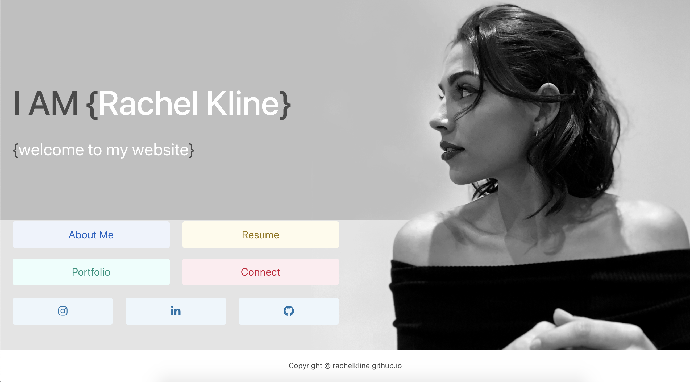

#Personal Portfolio

In this assignment, we were tasked with updating our functional, deployed website and updating our portfolio to include our recent group project and two homework assignments. We also had to update our contact informtion to include our phone number a&nd email, add links to our linkedIn & gitHub, and add our resume. For each portfolio item, we had to include a link to the deployed, a link to the repository, and give a short description of the project.

We weren't given any paramaters for design, so I really enjoyed being able to create this from scratch!! Alogside updating the format, backgrounds and colors, I was able to add some cool JS properties to show off what I've learned in the last few weeks. We also were tasked with pinning some of our repositories on gitHub and updating our linkedIn profiles to include this course in our education.